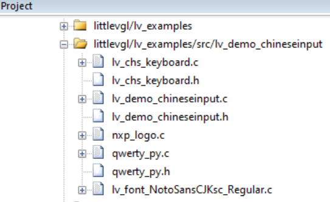
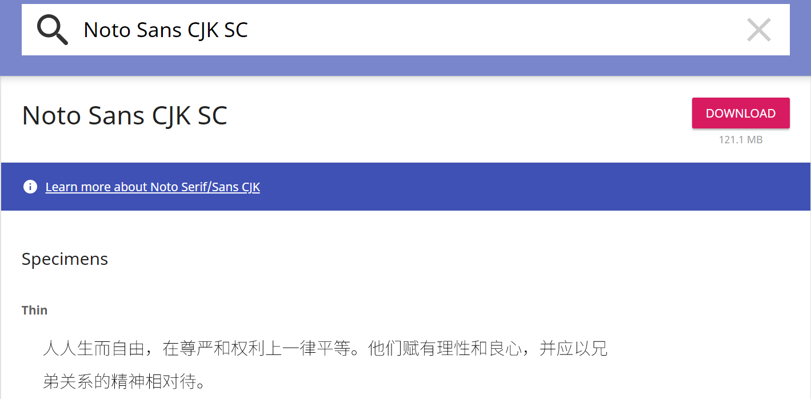
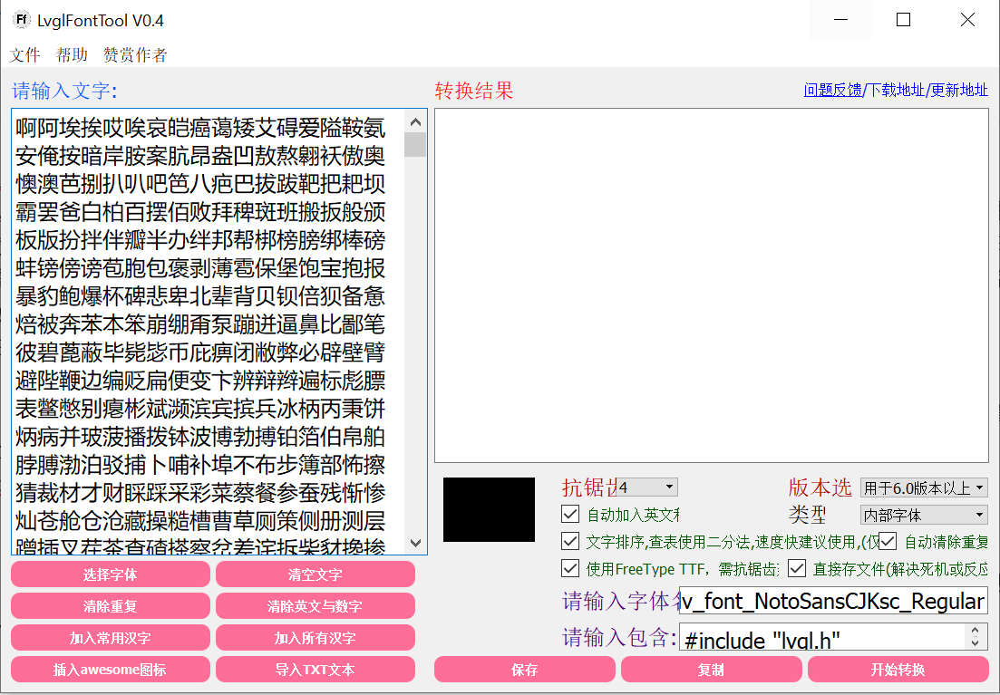
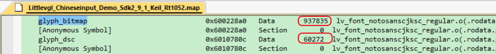
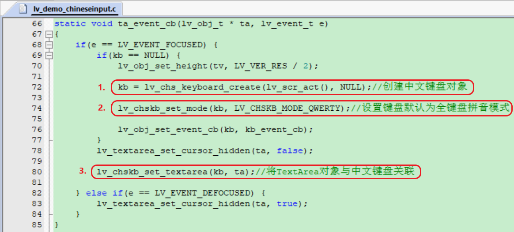

# Chinese-Input-Method-Framework-on-MCU-based-LittleVgl-GUI
**测试环境：**

SDK版本：SDK_v2.9.1

SDK参考例程：boards\evkbimxrt1050\littlevgl_examples\littlevgl_demo_widgets

LittleVgl版本：v7.4.0

IDE工具：Keil_v5.31

开发板：MIMXRT1050-EVK + 480*272 RGB LCD屏

**软件说明：**

我们先看下这套中文输入法所需的几个文件，如下图所示，.c和.h文件加起来一共7个，其中nxp_logo.c只是我额外加的一个NXP的官方logo图标转成的C数组文件供littleVgl调用显示，属于锦上添花的东西，可有可无，真正跟输入法相关的是剩下的6个文件，下面我们逐一介绍下这几个文件的作用：  
​                                             

**（1）qwerty_py.c/.h**

​实际上这两个文件才是这套全键盘拼音中文输入法的核心框架，实现了对输入的拼音字母进行索引匹配对应的汉字候选列表，这部分我是移植了如下链接中网友分享的代码，所以这两个文件我的角色只是一个大自然搬运工，不过说实话我是很感激该网友的无私分享的（这也是我一直推崇开源分享精神的源动力），之前对平时使用的各种输入法里面的算法原理一直充满好奇，直到看了这篇文章后才豁然开朗，“So that is what it is!”，让我获益匪浅（可能人的学习曲线和知识体系就是这样一点一滴的积累吧），而且更关键的是，如果让我继续往下开发诸如拼音联想和多汉字输入等功能的话，我更多关心的可能只是逻辑搭建的工作量问题，而不是纠结于Yes or No的问题了，因为咱已经了解了其最底层的工作原理了，所以很多复杂的事情，我们如果能抽丝剥茧的找到其最底层的本质（虽然这真的很难），那很多让人抓耳挠腮的问题很快就可以理清思路。说到这里我思维又发散了，呵呵，我想起让Linus Torvalds等一波老大神们一直头疼的Linux内核维护后继无人的问题，其实我的个人理解有很大一部分原因是如今的Linux太庞大了以至于几乎没有后辈的人对Linux的理解能赶上这些老辈大神，而这些老辈大神的最大优势是他们创建了Linux最早期的底层框架而且难能可贵的是一直在follow Linux每个版本的历史。总之，推荐大家看看如下这篇文章吧（实际上主要内容也都是代码），希望能各有所获；

https://www.amobbs.com/thread-5668320-1-1.html?_dsign=0939dcbd

**（2）lv_chs_keyboard.c/.c文件**

​这部分就是我的主要工作了（咱也不能啥都搬运…，这是体现咱的value的东西不是），我把它当作littleVgl的一个补充组件来写的，里面的大多数API参考官方littlevgl的lv_keyboard.c，所谓的文章开头的嵌入中文输入法到LittleVgl GUI环境中实际上就是这两个文件干的活，即将上面提到qwerty.c/.h实现的拼音输入法与LittleVgl框架结合到一块，起到一个桥梁的作用，所以如果你想把这套中文输入法嵌入到其他GUI环境中的话（比如emWin，GUIX，TouchGFX等），那主要的工作就是参考这两个文件的内容了；

**（3）lv_font_NotoSansCJKsc_Regular.c字体文件**

​虽然littleVgl官方源码包里自带了一个中文字体文件（\lvgl\src\lv_font\lv_font_simsun_16_cjk.c），但是它只包含了1000个左右最常用的字，我实际体验了下很多我们想用的字都找不到，所以这个时候就需要自己去做一个更全一点的字体库了。这里面涉及到两个问题需要考虑，第一是很多我们常见的中文字体是收费的（咱PC机的Microsoft Office套件里的中文字体都是微软付费买的，所以咱也理解下早年正版Windows为啥辣么贵了，那你问为啥现在便宜了？因为人家现在不靠这个赚钱了呗），第二个是字体转换工具的问题，我们网上找到的字体都是TTF或者OTF格式的，但littleVgl是不认的，需要转换成它支持的字体格式。

​对于第一个问题，我网上搜了好久最终选择了目前用的比较多的Google开源免费的字体，Google真乃金主也，它维护的网站里面字体各种各样啥都有且是开源免费的，如下链接，我选择的是NotoSansCJKsc字体（最后面的sc表示simplified Chinese，简体中文），然后它里面又包含了各种字形（regular, bold, light等），可以根据需要自行选择，整个包很大（100多MB），拆分成不同字形的就小了（每个14~16MB左右）；

https://www.google.com/get/noto/

​                                           

​对于第二个字体转换工具的问题，LittleVgl官方自带了一个字体转换工具（online font converter）,我个人觉着不太好用（对OTF字体支持的不行），这里推荐阿里大神自己做的一个LittleVgl字体转换工具（LvglFontTool），非常方便好用，且支持加入Awesome图标；

http://www.lfly.xyz/forum.php?mod=viewthread&tid=24&extra=page%3D1

​                               

​关于字体这部分我需要再补充个问题，就是它占用的memory大小，毕竟我们是在嵌入式MCU平台Flash和RAM的资源是受限的，如下图所示，该字体文件占用大概1Mbytes的rodata空间（即可寻址的Flash空间，当然该大小可以通过在上图转换工具中增减一些文字来调 整），所以在移植本套输入法之前需要预留足够的Flash空间，当然对RT平台来说这部分还好，毕竟其本身就外扩至少几MB空间的QSPI Flash作为存储空间的。

​                     

**（4）lv_demo_chineseinput.c/.h文件**

​这两个文件属于应用层实现了，主要关注该文件中下图的ta_event_cb函数（即textarea事件的callback，点击文本框的输入时回调），在里面我们需要按照1，2，3去调用即可（这三步的API均在lv_chs_keyboard.c/h文件里实现）；

​                           

​至此，这套全键盘拼音中文输入法框架所需的几个文件就介绍完了，用户只需要把这几个文件放到自己的工程设置好文件搜索路径，并参考随本文档附带的代码工程示例，再结合自己产品的GUI样式，把这套中文输入法嵌入到自己应用当中。
